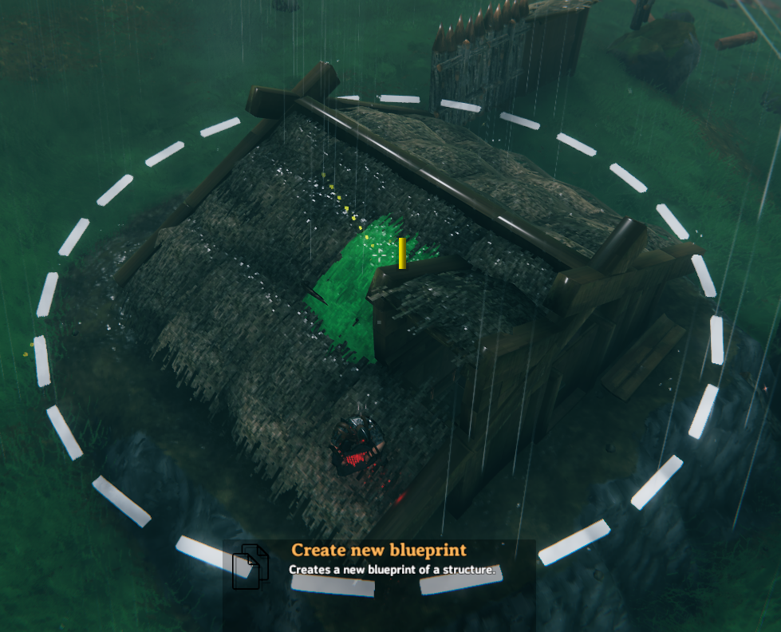
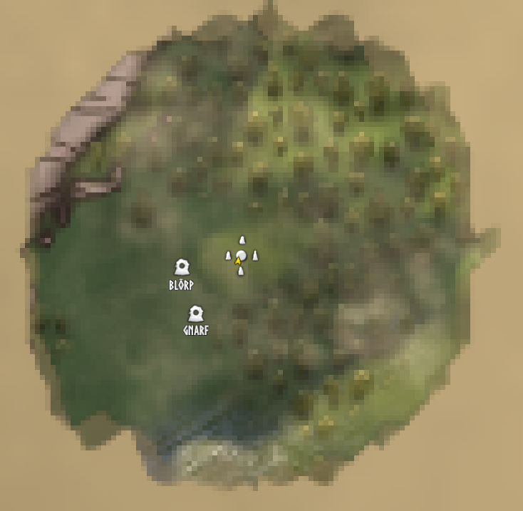
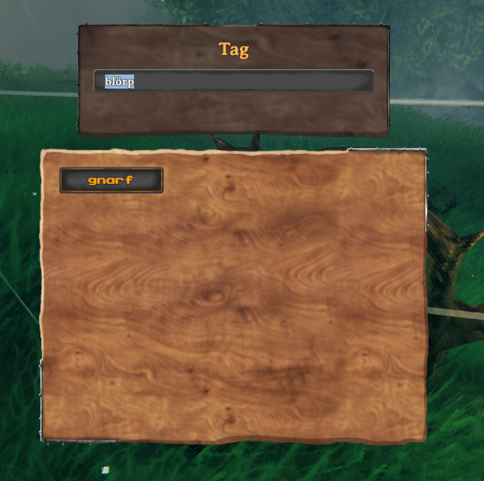
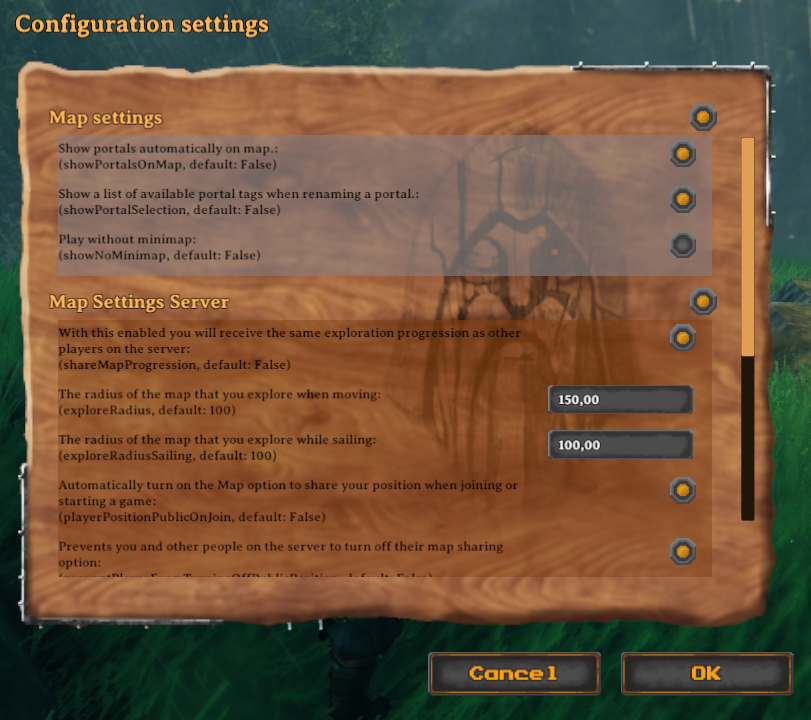

# Veilheim

Veilheim is a small mod for the game Valheim built by [sirskunkalot](https://github.com/sirskunkalot) and [Algorithman](https://github.com/Algorithman) to use on their own servers. Now also open to the public. Provided *as is*.

## Blueprints

Create copies of your structures and rebuild them anywhere. You can share your blueprints with ease, too.

## Map and portal sharing

Exploration data can be shared with all users on a server. No need to be logged in for receiving the updates. Exploration data of all users on a server is saved and pushed to all clients connecting. Configured per world.

Portal location can by displayed on the map. Configured per client.

## Unconnected portal list

Show a list of unconnected portals to connect with when naming a portal. Configured per client.

## Configuration GUI and sync

All configurations can be made with an ingame GUI. Server-only configuration gets synced to all connecting clients while client configuration can be set on each client individually. Only server admins can set server configuration.
All configurations can be made directly in an INI file or via console commands, too.

## Game mechanic changes

There are small changes which can be made through the config system:

* Configure production input amounts for the Kiln, Smelter, Furnace, Windmill and Spinning Wheel
* Force users to be "visible to public" on the server an spawn or disable the setting completely so users are always visible.
* Disable the use of the minimap for users on the server.

# Licence

[WTFPL](http://www.wtfpl.net/)